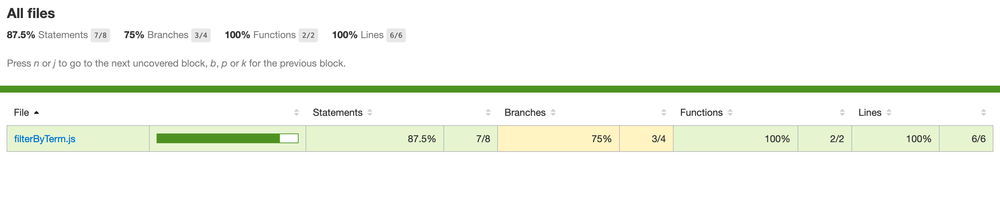

# Getting Started With Jest for JavaScript Testing 

[](https://opensource.org/licenses/MIT) [](https://GitHub.com/Naereen/StrapDown.js/graphs/contributors/) [](https://github.com/ellerbrock/open-source-badges/) [](https://saythanks.io/to/kennethreitz)



## What is Jest?

[Jest](https://jestjs.io/) is a JavaScript test runner, that is, a JavaScript library for creating, running, and structuring tests. Jest is distributed as an NPM package, you can install it in any JavaScript project. Jest is one of the most popular test runner these days and the default choice for Create React App.

## How do I know what to test?

When it comes to **testing**, even a simple block of code could paralyze beginners. The most common question is **"How do I know what to test?"**. If you're writing a web application a good starting point would be testing every page of the app and every user interaction. But web applications are also made of **units of code like functions and modules** that need to be tested too. There are two scenarios most of the times:

* you inherit **legacy code** which comes without tests
* you have to **implement a new functionality** out of thin air

What to do? For both cases you can help yourself by thinking of **tests** as of bits of code that **check if a given function produces the expected result**. Here's how a typical test flow looks like:

1. import the function to test
2. give an **input to the function**
3. **define what to expect** as the output
4. **check if the function produces the expected output**

Really, that's it. Testing won't be scary anymore if you think in these terms: **input - expected output - assert the result**. 

## Setting up the project

As with every **JavaScript project** you'll need an **NPM environment** (make sure to have **Node** installed on your system). Create a new folder and initialize the project with:

```mkdir getting-started-with-jest && cd $_```

```npm init -y```

Next up install **Jest** with:

```npm i jest --save-dev```

Open up **package.json** and configure the script named **"test"** for running **Jest**:

```json
"scripts": {
    "test": "jest"
  },
```
and you're good to go!

## Code coverage

Jest has built-in **code coverage** and you can activate it in two ways:

1. via the command line by passing the flag ```"--coverage"```
    
2. by configuring Jest in ```package.json```

To run the test with coverage:

```npm test -- --coverage```

---

If you want to keep code coverage always active configure Jest in ```package.json``` like so:

```json
"scripts": {
    "test": "jest"
  },
  "jest": {
    "collectCoverage": true
  },
```
You can also pass the flag to the test script:

```json
"scripts": {
    "test": "jest --coverage"
  },
```
If you're a visual person there's also a way to have an **HTML report for code coverage**, it's simply as configuring Jest like so:

```json
"scripts": {
    "test": "jest"
  },
  "jest": {
    "collectCoverage": true,
    "coverageReporters": ["html"]
  },
```